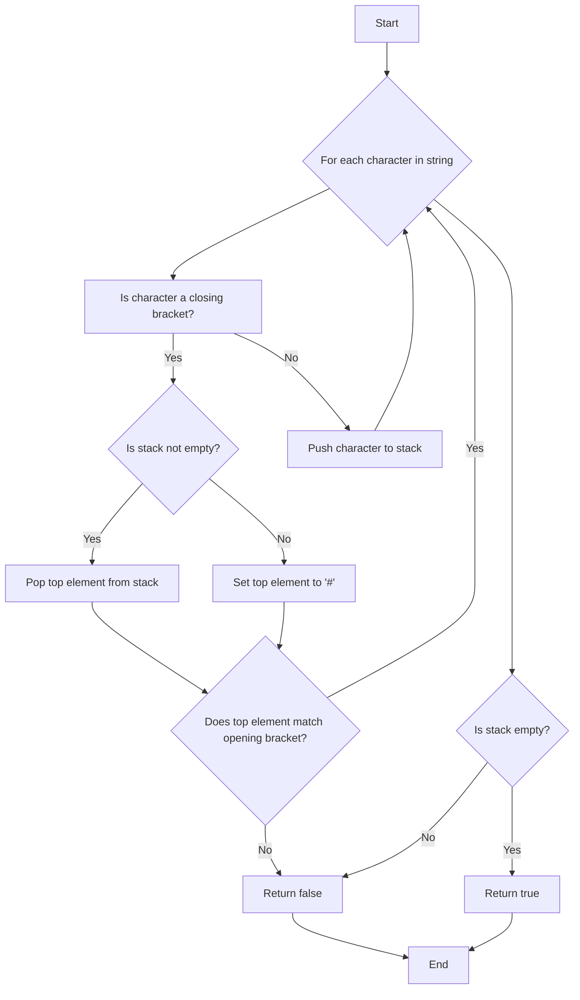

# Stack Questions

```js
class Stack {
  constructor() {
    this.items = [];
  }

  push(item) {
    this.items.push(item);
  }

  pop() {
    if (this.isEmpty()) {
      return null;
    }
    return this.items.pop();
  }

  peek() {
    return this.items[this.items.length - 1];
  }

  isEmpty() {
    return this.items.length === 0;
  }

  size() {
    return this.items.length;
  }
}
```

## Questions And Solutions

### Valid Parentheses

#### Problem: Given a string containing just the characters '(', ')', '{', '}', '[', and ']', determine if the input string is valid. An input string is valid if

- Open brackets must be closed by the same type of brackets.
- Open brackets must be closed in the correct order.

```bash
Example 1:
 Input: "()"
 Output: true
```

```bash
 Example 2:
 Input: "()[]{}"
 Output: true
```

```bash
 Example 3:
 Input: "(]"
 Output: false
```

```bash
 Example 4:
 Input: "([)]"
 Output: false
```

#### Solution

```js
// solution
function isValid(s) {
  let stack = [];
  const map = {
    ")": "(",
    "}": "{",
    "]": "[",
  };

  for (const char of s) {
    console.log("Processing character:", char);
    if (char in map) {
      const topElement = stack.length ? stack.pop() : "#";
      console.log("Popped from stack:", topElement);
      if (topElement !== map[char]) {
        console.log("Mismatch found, returning false");
        return false;
      }
    } else {
      stack.push(char);
      console.log("Pushed to stack:", char);
    }
    console.log("Current stack state:", stack);
  }

  const result = stack.length === 0;
  console.log("Final stack state:", stack, "Returning:", result);
  return result;
}

console.log(isValid("([{}])")); // true
console.log(isValid("()")); // true
console.log(isValid("()[]{}")); // true
console.log(isValid("(]")); // false
console.log(isValid("([)]")); // false
console.log(isValid("{[]}")); // true
```


